# 01 — Individual Problem Scan

## 1. Bảng quét vấn đề diện rộng (Problem Scan)

Dưới đây là danh sách 8 vấn đề được quét từ trải nghiệm học tập, làm việc và đời sống thực tế cá nhân (vượt mức tối thiểu 5 vấn đề để đạt điểm bonus):

| # | Lăng kính | Vấn đề quan sát được | Ai đang gặp khó khăn? | Dấu hiệu thực tế & Đo lường |
| :--- | :--- | :--- | :--- | :--- |
| 1 | **Lặp lại** / **Tốn thời gian** | Nghiên cứu và phân tích VOD (trận đấu quay lại) TFT của các tuyển thủ để học chiến thuật. | Game thủ TFT bán chuyên, người muốn leo rank cao. | Mỗi video dài 40-45 phút, mất rất nhiều thời gian tua đi tua lại để nhận diện mốc xoay bài. Trung bình tốn 45 phút/video. |
| 2 | **Lặp lại** | Trích xuất dữ liệu thô và dọn dẹp số liệu đo đạc nghiên cứu khoa học để vẽ đồ thị Gnuplot. | Sinh viên làm nghiên cứu, kỹ sư phòng thí nghiệm. | Diễn ra hàng tuần. Phải lọc thủ công hàng trăm file log dạng `.txt` hoặc `.csv` rời rạc để định dạng đúng chuẩn của Gnuplot, tốn 60 phút/lần. |
| 3 | **Tốn thời gian** | Nhập liệu chi tiêu tài chính cá nhân từ hóa đơn và lịch sử giao dịch. | Người dùng cá nhân muốn quản lý tài chính. | Mất 20 phút mỗi ngày gom hóa đơn giấy, ảnh chụp màn hình chuyển khoản để nhập tay vào file Excel hoặc app. Dễ nản và bỏ cuộc giữa chừng. |
| 4 | **Pain từ người khác** | Tra cứu và tìm kiếm tài liệu học tập, slide bài giảng bị trôi trong group chat chung. | Sinh viên trong các nhóm học tập trên Discord/Teams. | Sinh viên thường xuyên hỏi lại: "Ai có slide buổi 3 không gửi lại giúp mình?". Mỗi lần tìm kiếm thủ công mất 10-15 phút lục lọi tin nhắn cũ. |
| 5 | **AI có thể tốt hơn** | Tra cứu ý nghĩa và luật áp dụng của biển báo giao thông phụ, biển cấm theo giờ khi đang di chuyển. | Người tham gia giao thông bằng xe máy/ô tô tại các đô thị lớn. | Rất khó tra cứu nhanh luật hoặc biển báo phụ nhiều chữ khi đang lái xe. Dễ đi sai luật dẫn đến bị phạt. |
| 6 | **Lặp lại** | Viết báo cáo tiến độ tuần (Weekly Status Update) cho lab học tập hoặc dự án. | Học viên, PM dự án. | Mất 30 phút mỗi tuần để thu thập thông tin từ Slack cá nhân, lịch sử Git commit để viết lại thành báo cáo có cấu trúc. |
| 7 | **Tốn thời gian** | Đọc hiểu và tóm tắt tài liệu nghiên cứu dài hoặc spec kỹ thuật (PRD). | Sinh viên, Designer, Developer. | Mỗi tài liệu dài 15-20 trang tốn khoảng 45-60 phút để đọc hết và nắm ý chính trước khi phản biện hoặc làm việc. |
| 8 | **AI có thể tốt hơn** | Soạn thảo code boilerplate và cấu trúc lệnh vẽ biểu đồ trong Gnuplot. | Sinh viên nghiên cứu. | Phải liên tục tra cứu lại cú pháp thiết lập trục tọa độ, font chữ, nét vẽ trong Gnuplot. Mất 15-20 phút cho mỗi lần thiết lập biểu đồ mới. |

---

## 2. Lọc và chọn lựa Top 3 vấn đề

Từ danh sách 8 vấn đề trên, tôi chọn ra Top 3 vấn đề tiềm năng nhất để đi sâu phân tích:

| Hạng | Vấn đề | Vì sao chọn? | Điều còn chưa chắc chắn |
| :--- | :--- | :--- | :--- |
| **1** | **Phân tích VOD TFT** | Quy trình hiện tại rõ ràng, nỗi đau tốn thời gian rất lớn (45 phút/trận). AI có thể giải quyết vượt trội bằng Computer Vision và Reasoning. | Cách đánh giá chất lượng phân tích chiến thuật của AI thế nào là "đủ tốt" so với con người. |
| **2** | **Tự động hóa dọn dẹp dữ liệu & vẽ đồ thị Gnuplot** | Tần suất lặp lại hàng tuần, quy trình gồm nhiều bước cơ học rõ ràng, mất nhiều công sức định dạng. | Rủi ro ảo giác (hallucination) của AI khi xử lý các số thập phân nghiên cứu đòi hỏi chính xác 100%. |
| **3** | **Trợ lý tự động hóa nhập liệu chi tiêu** | Nỗi đau thực tế nhiều người gặp phải, ảnh hưởng trực tiếp đến thói quen tài chính hàng ngày. | Rào cản bảo mật thông tin (Privacy) khi người dùng ngại tải hóa đơn hoặc ảnh chụp banking lên hệ thống. |

---

## 3. Chi tiết Top 3 Problem Cards & Draft Workflows

### 📑 PROBLEM CARD #1: Phân tích VOD TFT

*   **Problem 1 câu:** Người chơi TFT mất quá nhiều thời gian (khoảng 45 phút cho mỗi video VOD dài 40 phút) để tua và tự phân tích, suy đoán lý do xoay bài/lên cấp của tuyển thủ một cách thủ công.
*   **Actor:** Game thủ TFT có nhu cầu nghiên cứu chiến thuật nâng cao.
*   **Thời điểm / bối cảnh:** Khi muốn cập nhật meta mới hoặc học hỏi tư duy của các tuyển thủ hàng đầu từ các video giải đấu trên YouTube/Twitch.
*   **Current workflow:**
    1. Mở video VOD trên trình duyệt.
    2. Tua thủ công để tìm các mốc thời gian xảy ra biến động lớn (ví dụ: mất chuỗi thắng/thua, roll cạn tiền, đổi đội hình).
    3. Ghi nhận các thao tác bề nổi (tướng mua, trang bị ghép).
    4. Dừng video, tự quan sát bối cảnh lobby (máu, vàng, các nhà khác) và suy đoán lý do tuyển thủ hành xử như vậy.
    5. Rút ra kết luận và ghi chép chiến thuật vào sổ tay/file note.
*   **Bottleneck:** Bước 4 - Tự quan sát bối cảnh và suy đoán lý do xoay bài mất rất nhiều thời gian (15-20 phút mỗi pha xử lý) và dễ bị sai lệch do bỏ sót thông tin.
*   **Impact:** Lãng phí thời gian, dễ gây chán nản, giảm hiệu suất nghiên cứu (chỉ xem được 1-2 video mỗi tuần).
*   **Success metric:** Giảm tổng thời gian nghiên cứu 1 VOD từ 45 phút xuống dưới 10 phút. Tỷ lệ trích xuất đúng các mốc thời gian quan trọng >90%.
*   **Non-AI alternative:** Xem các video highlight được cắt sẵn hoặc đọc bài phân tích bằng chữ của người khác. Tuy nhiên, highlight thường thiếu bối cảnh chi tiết và bài phân tích chữ thì cập nhật rất chậm so với meta.
*   **AI hypothesis:** Dùng mô hình Multimodal (Computer Vision + Reasoning) quét luồng video, nhận diện các thông số (vàng, máu, cấp độ, round đấu) để lập bản đồ biến số, sau đó lý giải logic hành động của tuyển thủ. Người dùng chỉ cần đọc báo cáo phân tích đính kèm các đoạn cắt 10s để đối chiếu.
*   **Quick gut:** Agent (do cần tư duy đa biến số và logic mờ).

#### Draft Workflow #1 (Phân tích VOD TFT)

```mermaid
graph TD
    subgraph CURRENT STATE - 45 phút
        A1[1. Mở video VOD: 2'] --> A2[2. Tua tay tìm mốc biến động: 10']
        A2 --> A3[3. Ghi nhận thao tác bề nổi: 10']
        A3 --> A4["4. Tự quan sát bối cảnh & suy đoán lý do: 15' (BOTTLENECK)"]
        A4 --> A5[5. Rút ra bài học & ghi chép: 8']
    end

    subgraph FUTURE STATE - 9 phút
        B1[1. Gửi link VOD cho AI Agent: 1'] --> B2[2. Agent quét video & lập bản đồ biến số: 3']
        B2 --> B3[3. Agent phân tích logic & tạo báo cáo: 2']
        B3 --> B4["4. Đọc báo cáo giải thích & đối chiếu video 10s: 3' (HUMAN BOUNDARY)"]
    end
    
    style A4 fill:#ffcccc,stroke:#ff0000
    style B4 fill:#ccffcc,stroke:#00aa00
```



---

### 📑 PROBLEM CARD #2: Tự động hóa dọn dẹp dữ liệu & vẽ đồ thị Gnuplot

*   **Problem 1 câu:** Sinh viên nghiên cứu tốn đến 60 phút mỗi tuần làm công việc cơ học dọn dẹp các tệp log thô (`.txt`, `.csv`) và soạn thảo boilerplate code để vẽ đồ thị khoa học trong Gnuplot.
*   **Actor:** Sinh viên nghiên cứu khoa học, kỹ sư phân tích dữ liệu phòng thí nghiệm.
*   **Thời điểm / bối cảnh:** Cuối tuần khi cần tổng hợp số liệu đo đạc từ các máy đo (nhiệt độ, năng lượng, hiệu suất) để đưa vào báo cáo tiến độ hoặc bài báo khoa học.
*   **Current workflow:**
    1. Thu thập hàng chục file log thô từ máy đo.
    2. Sử dụng Excel hoặc script tự viết để lọc bỏ các dòng rác, định dạng lại dấu phẩy/chấm thập phân.
    3. Tạo file dữ liệu sạch cuối cùng dạng `.dat`.
    4. Mở file mẫu Gnuplot cũ, copy boilerplate code vẽ đồ thị.
    5. Sửa đổi thủ công các tham số vẽ (tên trục, giới hạn trục x-y, chú thích, màu sắc đường vẽ).
    6. Chạy lệnh vẽ và xuất ra file ảnh `.png`/`.eps`.
*   **Bottleneck:** Bước 2 (dọn dẹp dữ liệu thô) và Bước 5 (chỉnh sửa boilerplate code vẽ biểu đồ thủ công) tốn rất nhiều thời gian lặp đi lặp lại.
*   **Impact:** Tốn công sức cho các đầu việc thủ công, dễ gõ nhầm cú pháp vẽ đồ thị gây lỗi hiển thị.
*   **Success metric:** Giảm thời gian chuẩn bị dữ liệu và vẽ đồ thị từ 60 phút xuống dưới 10 phút/lần.
*   **Non-AI alternative:** Viết một script Python cứng (`pandas` + `matplotlib`). Tuy nhiên, cấu trúc file log thô từ các máy đo khác nhau thường xuyên thay đổi nhẹ, khiến script cứng dễ bị lỗi (crash) và sinh viên phải sửa code liên tục.
*   **AI hypothesis:** AI hỗ trợ nhận diện cấu trúc file log thô mới, tự sinh script Python/Bash dọn dẹp dữ liệu và tự động viết file cấu hình lệnh vẽ Gnuplot chuẩn xác theo yêu cầu hiển thị.
*   **Quick gut:** Rule kết hợp với Workflow (Không dùng Agent vì rủi ro ảo giác số liệu khoa học là không thể chấp nhận).

#### Draft Workflow #2 (Tự động hóa Gnuplot)

```text
CURRENT STATE — 60 phút

[1 Thu thập log thô: 5']
→ [2 Lọc rác & định dạng thập phân thủ công: 20']  <-- Bottleneck 1
→ [3 Tạo file .dat: 5']
→ [4 Copy code Gnuplot cũ: 5']
→ [5 Sửa code vẽ & giới hạn trục x-y thủ công: 20'] <-- Bottleneck 2
→ [6 Chạy lệnh xuất ảnh: 5']

FUTURE STATE — 10 phút

[1 Upload log thô & mô tả yêu cầu vẽ: 2']
→ [2 AI nhận diện cấu trúc & tự chạy script dọn dẹp: 2'] (Workflow step)
→ [3 AI sinh cấu hình vẽ Gnuplot chuẩn: 2'] (Workflow step)
→ [4 Sinh viên kiểm tra code vẽ & duyệt xuất ảnh: 4'] <-- Human Boundary
```

---

### 📑 PROBLEM CARD #3: Trợ lý tự động hóa nhập liệu chi tiêu

*   **Problem 1 câu:** Người dùng cá nhân tốn 20 phút mỗi ngày để mở ứng dụng ngân hàng, kiểm tra ví và nhập thủ công từng khoản chi tiêu nhỏ lẻ vào file Excel hoặc app quản lý tài chính.
*   **Actor:** Người dùng cá nhân muốn theo dõi dòng tiền hàng ngày.
*   **Thời điểm / bối cảnh:** Cuối ngày hoặc ngay sau khi thực hiện giao dịch mua sắm, ăn uống.
*   **Current workflow:**
    1. Chụp ảnh hóa đơn giấy hoặc chụp màn hình giao dịch chuyển khoản (banking).
    2. Cuối ngày, mở ứng dụng ghi chép tài chính hoặc Excel.
    3. Nhìn hình ảnh đã chụp, gõ thủ công số tiền, ngày giờ, nội dung.
    4. Phân loại khoản chi vào các nhóm (Ăn uống, Di chuyển, Hóa đơn, Giải trí).
    5. Nhập các khoản chi cố định định kỳ (tiền nhà, tiền điện) bằng tay nếu đến kỳ.
*   **Bottleneck:** Bước 3 và 4 (Nhập tay số liệu và tự phân loại) gây chán nản, khiến người dùng dễ bỏ cuộc sau 1-2 tuần.
*   **Impact:** Không theo dõi được tài chính cá nhân, chi tiêu quá đà, mất kiểm soát dòng tiền.
*   **Success metric:** Giảm thời gian nhập liệu hàng ngày từ 20 phút xuống dưới 2 phút. Tỷ lệ phân loại đúng danh mục chi tiêu đạt >95%.
*   **Non-AI alternative:** Sử dụng các ứng dụng tự động đọc tin nhắn SMS biến động số dư. Tuy nhiên, hiện tại hầu hết mọi người đã chuyển sang dùng App thông báo (Notification) thay vì SMS, và các app này không đọc được hóa đơn giấy hoặc ảnh chụp chuyển khoản.
*   **AI hypothesis:** Người dùng chỉ cần gửi ảnh chụp hóa đơn/ảnh giao dịch vào một chatbot (Telegram/Zalo). AI OCR tự trích xuất thông tin (số tiền, thời gian, cửa hàng) và tự động phân loại danh mục, sau đó đồng bộ thẳng lên Google Sheets của người dùng.
*   **Quick gut:** Workflow (Kết hợp OCR + LLM phân loại).

#### Draft Workflow #3 (Nhập liệu chi tiêu)

```text
CURRENT STATE — 20 phút/ngày

[1 Lưu hóa đơn/ảnh banking: 5']
→ [2 Mở Excel/App tài chính: 2']
→ [3 Gõ thủ công số tiền, nội dung từ ảnh: 8'] <-- Bottleneck
→ [4 Tự phân loại danh mục chi tiêu: 3']
→ [5 Nhập tay các khoản chi định kỳ: 2']

FUTURE STATE — 2 phút/ngày

[1 Gửi ảnh hóa đơn/ảnh banking vào Chatbot: 0.5']
→ [2 AI trích xuất thông tin & phân loại: 0.5'] (Workflow step)
→ [3 Nhận thông báo xác nhận từ AI, nhấn OK để duyệt: 1'] <-- Human Boundary
```

---

## 4. Lựa chọn vấn đề muốn Pitch nhất với nhóm

*   **Vấn đề muốn pitch nhất:** **Phân tích VOD TFT để học chiến thuật** (Problem Card #1).
*   **Lý do lựa chọn:**
    *   *Nỗi đau thực tế và sâu sắc:* Xem VOD là con đường duy nhất để nâng cao trình độ ở rank cao, nhưng việc ngồi tua và suy đoán tư duy của người khác cực kỳ mệt mỏi và tốn thời gian.
    *   *AI phát huy sức mạnh tối đa:* Đây là bài toán mà các giải pháp phi-AI (Non-AI alternative) như dashboard thuần túy đầu hàng vì không thể giải thích được "tư duy/lý do đằng sau hành động" (Reasoning).
    *   *Phù hợp để làm trong Lab:* Độ phức tạp vừa đủ để xây dựng một thiết kế Agent hoàn chỉnh, phân định rõ ràng ranh giới giữa Rule (bắt màu pixels, lấy timestamp) và AI Agent (OCR, suy luận bối cảnh đa biến số).
*   **Câu hỏi muốn nhóm phản biện (Challenge):**
    *   *Làm sao để hạn chế tối đa rủi ro AI giải thích sai (Hallucination) về chiến thuật của tuyển thủ?*
    *   *Luồng dữ liệu hình ảnh (VOD video) rất nặng, chúng ta nên thiết kế điểm can thiệp của AI ở đâu để tối ưu hóa hiệu năng tính toán (GPU cost)?*
